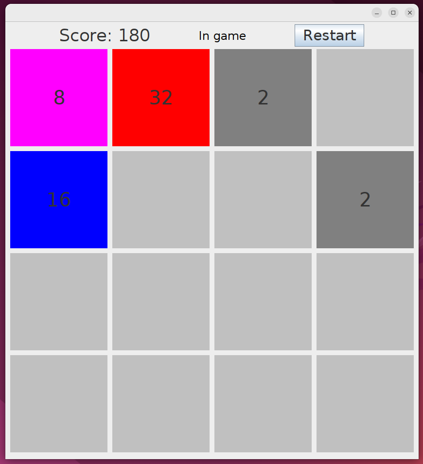
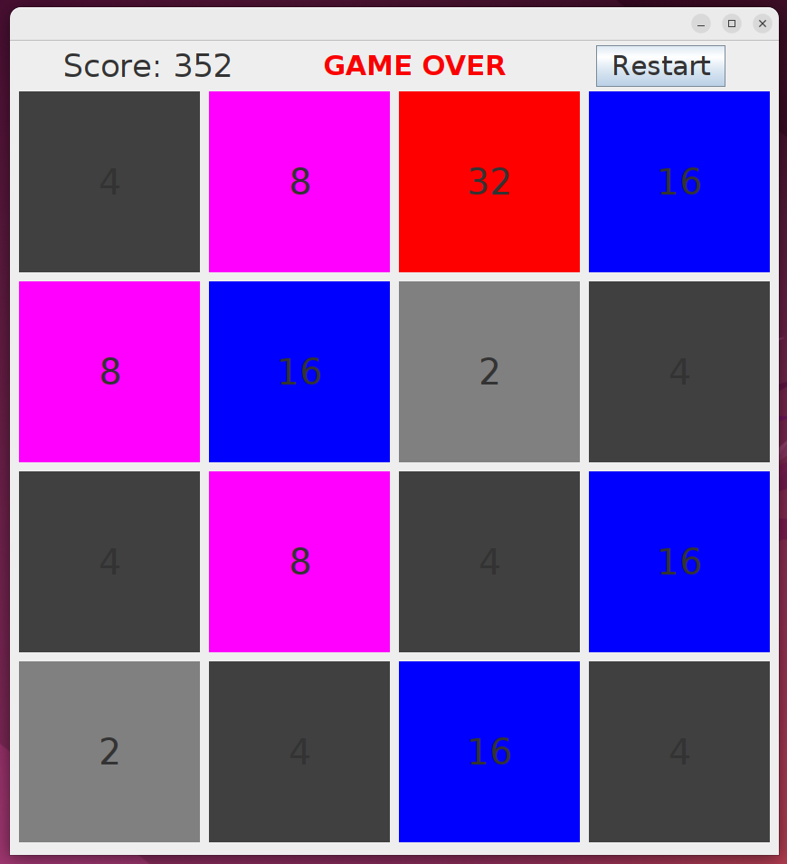

# 2048 Game in JavaFX

Welcome! This project is an implementation of the popular 2048 game using JavaFX

## Game Screenshots


*Screenshot 1: Example of the 2048 game*


*Screenshot 2: Another moment in the game*

## How to Run

1. Ensure that you have Java Development Kit (JDK) installed.
2. Clone the repository to your computer.
3. Navigate to the project directory using the terminal.
4. Run the game using the command:

    ```bash
    javaс -d out/ -cp src/ src/*
    ```
   ```bash
   java -cp out/ Main
    ```

## File Descriptions

- `ColorScheme.java`: Class defining the color scheme for game elements.
- `Main.java`: Main application class containing the entry point and game logic.
- `Tile.java`: Class represents the logic of working with tiles in the game.

## Gameplay Instructions

1. Use arrow keys to move tile elements in the desired direction.
2. When two identical tile elements collide, they merge into one with a higher value.
3. The goal of the game is to reach the tile element with a value of 2048.

## Developer

Project created and maintained by Leonid Kharin.

If you have suggestions for improvement or found a bug, please create an issue or pull request.

Good luck and enjoy the game! 🎮


